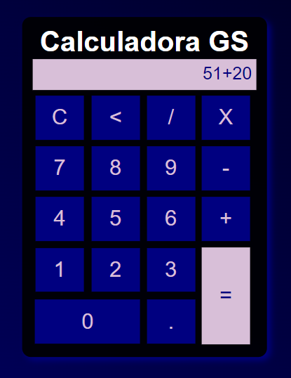

# Calculadora Básica

Um projeto simples, Primeiro projeto utilizando JavaScript 🚀

[]

## Tecnologias Utilizada

    - HTML
    - CSS
    - JavaScript

### Clone o Projeto

```

git clone https://github.com/gabilu0/
Calculadora-basica.git
```